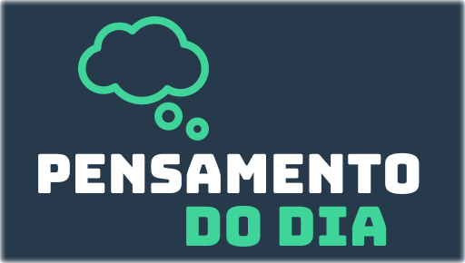
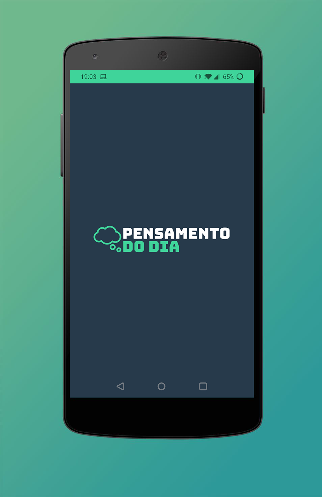
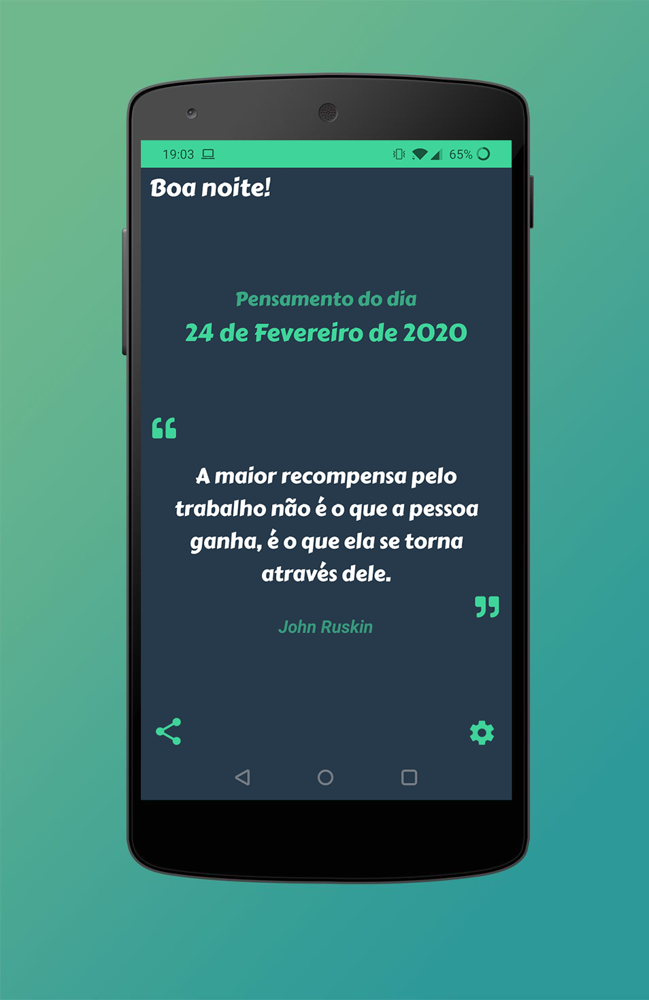
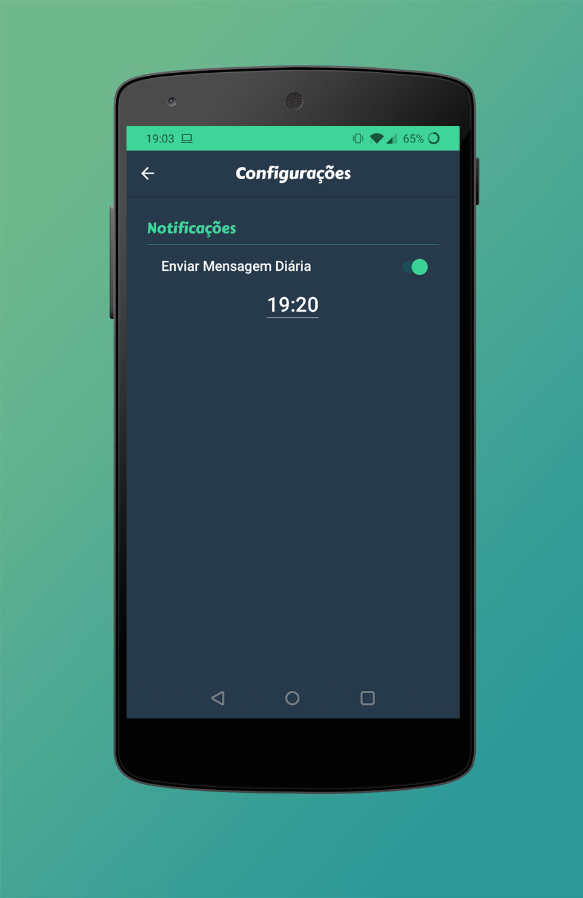
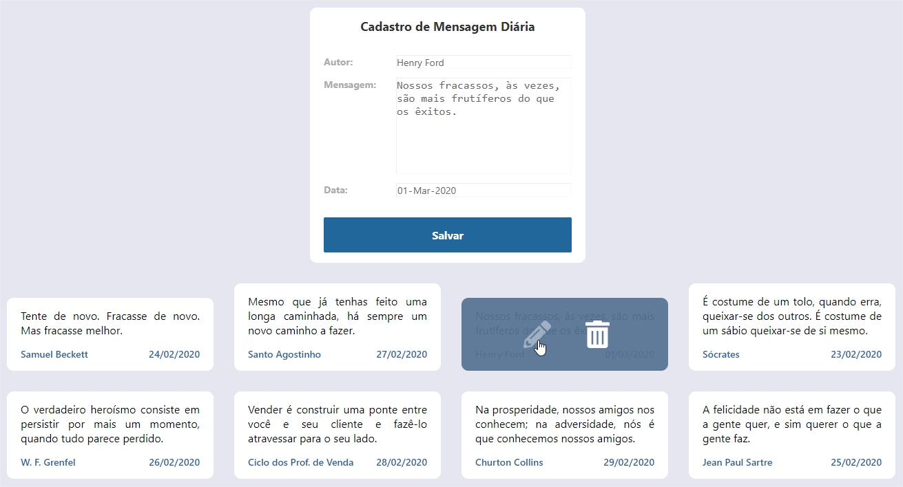

<h1 align="center">
    
</h1>

<h4 align="center">
  Aplicação mobile que notifica uma nova mensagem motivacional diariamente.  Backend, Interface web para cadastro e aplicação mobile.
</h4>

  

  
  
  

## 💻 Projeto

O 'Pensamento do Dia' é um projeto que visa motivar seus usuários através de mensagens e frases de autores famosos.

 

## :rocket: Tecnologias

Esse projeto foi desenvolvido com as seguintes tecnologias:

- [Node.js](https://nodejs.org/en/)
- [React](https://reactjs.org)
- [React Native](https://facebook.github.io/react-native/)
- [MongoDB](https://www.mongodb.com/)
- [Expo](https://expo.io/)

 

# Mobile App 
## [Google Play Store](https://play.google.com/store/apps/details?id=com.rovagnolilabs.pensamentododia "Pensamento do Dia")

  
  
  

 

# Interface Web

  

